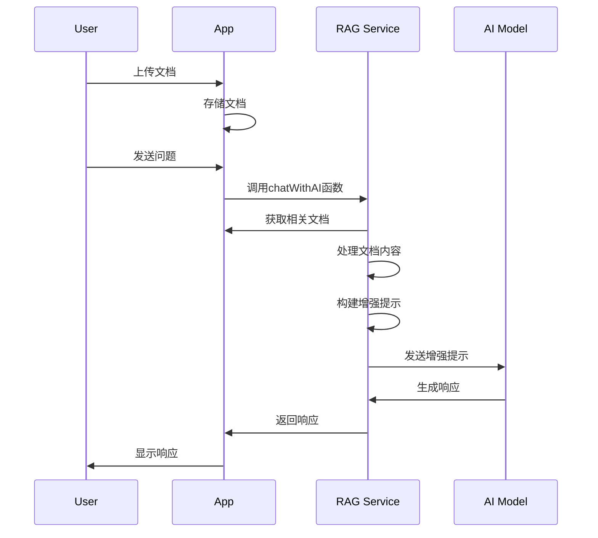

# DevFlowAI RAG机制参考文档

## 1. 概述

RAG（检索增强生成）是DevFlowAI系统的核心功能之一，它允许AI模型在生成响应时参考用户上传的文档，从而提供更准确、更相关的信息。本文档详细介绍了DevFlowAI中RAG机制的实现原理、工作流程和技术细节。

## 2. 核心组件

### 2.1 核心文件

| 文件名 | 路径 | 功能描述 |
|--------|------|----------|
| geminiService.ts | `src/services/geminiService.ts` | RAG核心逻辑实现，包含聊天、文档处理和模型调用 |
| App.tsx | `src/App.tsx` | 主应用文件，提供用户界面和文档管理功能 |

### 2.2 主要依赖

| 依赖名称 | 版本 | 用途 |
|----------|------|------|
| @google/genai | 最新 | Gemini模型API调用 |
| openai | 最新 | OpenAI模型API调用 |
| mammoth | 最新 | Word文档文本提取 |

## 3. RAG工作流程

DevFlowAI的RAG机制遵循经典的"检索-增强-生成"流程：



## 4. 详细实现

### 4.1 文档管理

#### 4.1.1 文档类型支持

| 文档类型 | 支持格式 | 处理方式 |
|----------|----------|----------|
| 文本 | .txt, .md, .json | 直接读取内容 |
| 图片 | .png, .jpeg, .webp, .heic, .heif | 以base64编码作为附件 |
| 音频 | .wav, .mp3, .aiff, .aac, .ogg, .flac | 以base64编码作为附件 |
| 视频 | .mp4, .mpeg, .mov, .avi, .flv, .mpg, .webm, .wmv, .3gpp | 以base64编码作为附件 |
| 文档 | .pdf, .docx | PDF直接作为附件，Word提取文本 |
| 其他 | 二进制文件 | 仅记录文件类型 |

#### 4.1.2 文档上传流程

1. 用户通过界面上传文档
2. 系统根据文档类型进行处理：
   - 文本文件：直接读取内容
   - Word文档：使用mammoth库提取文本
   - 媒体文件：转换为base64编码
3. 文档信息存储到系统中，包括：
   - id：唯一标识符
   - project_id：所属项目ID
   - title：文件名
   - content：文件内容或base64编码
   - extracted_text：提取的文本（仅Word文档）
   - type：文件MIME类型
   - created_at：创建时间

### 4.2 检索机制

在当前实现中，检索机制采用简单的全量检索方式：当用户发送问题时，系统会将当前项目下的所有文档作为上下文提供给AI模型。

### 4.3 增强机制

#### 4.3.1 文档内容处理

在`chatWithAI`函数中，系统会根据文档类型对内容进行不同处理：

```typescript
// 文档内容处理逻辑
if (doc.extracted_text) {
  // 有提取文本的文档（如Word），截取前5000个字符
  systemPrompt += `--- Document: ${doc.title} (ID: ${doc.id}) ---
${doc.extracted_text.substring(0, 5000)}

`;
} else if (!doc.content.startsWith('data:')) {
  // 普通文本，截取前2000个字符
  systemPrompt += `--- Document: ${doc.title} (ID: ${doc.id}) ---
${doc.content.substring(0, 2000)}

`;
} else {
  // 二进制文件
  const match = doc.content.match(/^data:([^;]+);base64,(.*)$/);
  if (match && SUPPORTED_INLINE_MIMES.includes(match[1])) {
    // 支持的媒体类型，作为附件
    systemPrompt += `--- Document: ${doc.title} (ID: ${doc.id}) ---
[File content provided as attachment]

`;
  } else {
    // 其他二进制文件，仅添加类型信息
    systemPrompt += `--- Document: ${doc.title} (ID: ${doc.id}) ---
[Binary file: ${doc.type}. Content not directly readable by AI.]

`;
  }
}
```

#### 4.3.2 系统提示构建

系统会构建包含文档内容的增强提示，明确要求AI在使用文档信息时添加引用：

```typescript
systemPrompt += `

When you use information from these documents, please cite them at the end of your response like this:

References:
- [Document Title](#doc-{document_id})
`;
```

### 4.4 生成机制

#### 4.4.1 模型支持

| 模型类型 | 支持的模型 | API Base URL |
|----------|------------|--------------|
| Gemini | gemini-3.1-pro-preview等 | https://generativelanguage.googleapis.com/v1beta/openai/ |
| OpenAI | gpt-4o, gpt-3.5-turbo等 | https://api.openai.com/v1 |

#### 4.4.2 流式输出

系统支持流式输出，允许AI响应实时显示给用户：

```typescript
// 流式输出实现
if (isStreaming && onChunk) {
  const stream = await ai.models.generateContentStream({
    model: modelConfig.modelName,
    contents: geminiContents,
    config: { systemInstruction: systemPrompt }
  });

  let fullResponse = "";
  for await (const chunk of stream) {
    const text = (chunk as any).text;
    if (text) {
      fullResponse += text;
      onChunk(text); // 实时回调
    }
  }
  return { text: fullResponse, usage: { promptTokens, completionTokens } };
}
```

## 5. 技术细节

### 5.1 文档大小限制

| 文档类型 | 大小限制 |
|----------|----------|
| 提取文本的文档 | 前5000个字符 |
| 普通文本 | 前2000个字符 |
| 媒体文件 | 无明确限制（取决于base64编码大小和模型支持） |

### 5.2 令牌使用记录

系统会记录每次AI调用的令牌使用情况：

- `prompt_tokens`：提示令牌数量
- `completion_tokens`：完成令牌数量

这些信息会存储在消息记录中，便于用户查看和分析。

### 5.3 支持的MIME类型

```typescript
const SUPPORTED_INLINE_MIMES = [
  'image/png', 'image/jpeg', 'image/webp', 'image/heic', 'image/heif',
  'audio/wav', 'audio/mp3', 'audio/aiff', 'audio/aac', 'audio/ogg', 'audio/flac',
  'video/mp4', 'video/mpeg', 'video/mov', 'video/avi', 'video/x-flv', 'video/mpg', 'video/webm', 'video/wmv', 'video/3gpp',
  'application/pdf'
];
```

## 6. 代码示例

### 6.1 调用RAG功能

```typescript
// 导入必要的模块
import { chatWithAI } from './services/geminiService';

// 准备参数
const projectId = 'project-123';
const messages = [{ role: 'user', content: '请解释文档中的核心概念' }];
const modelConfig = {
  modelName: 'gemini-3.1-pro-preview',
  apiKey: 'your-api-key',
  baseUrl: 'https://generativelanguage.googleapis.com/v1beta/openai/'
};
const documents = [/* 从API获取的文档数组 */];

// 调用RAG功能
const response = await chatWithAI(
  projectId,
  messages,
  modelConfig,
  documents,
  true, // 启用流式输出
  (chunk) => {
    console.log('Received chunk:', chunk); // 处理实时输出
  }
);

console.log('Final response:', response.text);
console.log('Token usage:', response.usage);
```

### 6.2 上传文档

```typescript
// App.tsx中的文档上传处理
const handleFileUpload = async (e: React.ChangeEvent<HTMLInputElement>) => {
  const file = e.target.files?.[0];
  if (!file || !activeProject) return;

  const isWord = file.type.includes('word') || file.name.endsWith('.docx');
  
  const reader = new FileReader();
  reader.onload = async (event) => {
    const content = event.target?.result as string;
    let extractedText = '';

    if (isWord) {
      // 提取Word文档文本
      const arrayBuffer = await file.arrayBuffer();
      const result = await mammoth.extractRawText({ arrayBuffer });
      extractedText = result.value;
    }

    // 创建文档对象
    const newDoc = {
      id: Math.random().toString(36).substring(7),
      project_id: activeProject.id,
      title: file.name,
      content: content,
      extracted_text: extractedText,
      type: file.type || 'application/octet-stream',
      step_number: null,
      folder_id: null
    };

    // 保存文档到服务器
    await fetch(`/api/projects/${activeProject.id}/documents`, {
      method: 'POST',
      headers: { 'Content-Type': 'application/json' },
      body: JSON.stringify(newDoc)
    });
  };

  // 根据文件类型选择读取方式
  if (file.type.startsWith('text/') || file.type === 'application/json' || file.name.endsWith('.md')) {
    reader.readAsText(file);
  } else {
    reader.readAsDataURL(file);
  }
};
```

## 7. 优化建议

### 7.1 检索优化

当前实现采用全量检索方式，随着文档数量增加，性能会下降。建议优化为：

1. 实现基于关键词的检索
2. 支持向量数据库（如Pinecone、Milvus）
3. 实现文档摘要和索引

### 7.2 文档处理优化

1. 增加文档分块和重组机制
2. 支持更多文档类型（如PPT、Excel）
3. 实现文档自动分类和标签

### 7.3 提示工程优化

1. 动态调整文档截断长度
2. 根据问题相关性排序文档
3. 实现更智能的引用生成机制

## 8. 总结

DevFlowAI的RAG机制提供了强大的文档增强生成功能，支持多种文档类型和AI模型。通过合理使用RAG功能，用户可以让AI模型更好地理解和利用项目文档，生成更准确、更相关的响应。

随着项目的发展，RAG机制将继续优化和增强，提供更高效、更智能的文档处理和检索能力。